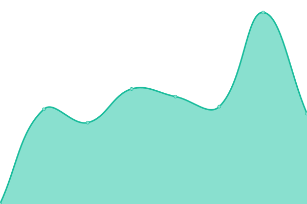

# [📈 Live Status](https://ilger02.github.io/Uptime): <!--live status--> **🟩 All systems operational**

This repository contains the open-source uptime monitor and status page for [ilger02](https://ilger02.github.io/Uptime), powered by [Upptime](https://github.com/upptime/upptime).

With [Upptime](https://upptime.js.org), you can get your own unlimited and free uptime monitor and status page, powered entirely by a GitHub repository. We use [Issues](https://github.com/ilger02/Uptime/issues) as incident reports, [Actions](https://github.com/ilger02/Uptime/actions) as uptime monitors, and [Pages](https://ilger02.github.io/Uptime) for the status page.

<!--start: status pages-->
<!-- This summary is generated by Upptime (https://github.com/upptime/upptime) -->
<!-- Do not edit this manually, your changes will be overwritten -->
<!-- prettier-ignore -->
| URL | Status | History | Response Time | Uptime |
| --- | ------ | ------- | ------------- | ------ |
|  IASACQUA | 🟩 Up | [iasacqua.yml](https://github.com/ilger02/Uptime/commits/HEAD/history/iasacqua.yml) | 

 1146ms
     
 | 

<a href="https://ilger02.github.io/Uptime/history/iasacqua">89.12%</a>
    

|  KOARA02 | 🟩 Up | [koara-02.yml](https://github.com/ilger02/Uptime/commits/HEAD/history/koara-02.yml) | 

 951ms
     
 | 

<a href="https://ilger02.github.io/Uptime/history/koara-02">89.12%</a>
    

|  VPS_QWEB | 🟩 Up | [vps-qweb.yml](https://github.com/ilger02/Uptime/commits/HEAD/history/vps-qweb.yml) | 

 959ms
     
 | 

<a href="https://ilger02.github.io/Uptime/history/vps-qweb">91.15%</a>
    

|  VPS2_QWEB | 🟩 Up | [vps-2-qweb.yml](https://github.com/ilger02/Uptime/commits/HEAD/history/vps-2-qweb.yml) | 

 891ms
     
 | 

<a href="https://ilger02.github.io/Uptime/history/vps-2-qweb">91.16%</a>
    

|  SIDERANET | 🟩 Up | [sideranet.yml](https://github.com/ilger02/Uptime/commits/HEAD/history/sideranet.yml) | 

 1004ms
     
 | 

<a href="https://ilger02.github.io/Uptime/history/sideranet">99.70%</a>
    

|  ZIM_WORDPOWER | 🟩 Up | [zim-wordpower.yml](https://github.com/ilger02/Uptime/commits/HEAD/history/zim-wordpower.yml) | 

 902ms
     
 | 

<a href="https://ilger02.github.io/Uptime/history/zim-wordpower">98.84%</a>
    

|  ZMAIL02 | 🟩 Up | [zmail-02.yml](https://github.com/ilger02/Uptime/commits/HEAD/history/zmail-02.yml) | 

 927ms
     
 | 

<a href="https://ilger02.github.io/Uptime/history/zmail-02">89.91%</a>
    

|  PORTIALTOTIRRENO | 🟩 Up | [portialtotirreno.yml](https://github.com/ilger02/Uptime/commits/HEAD/history/portialtotirreno.yml) | 

 808ms
     
 | 

<a href="https://ilger02.github.io/Uptime/history/portialtotirreno">89.40%</a>
    

|  ZIMBRA9 | 🟩 Up | [zimbra-9.yml](https://github.com/ilger02/Uptime/commits/HEAD/history/zimbra-9.yml) | 

 868ms
     
 | 

<a href="https://ilger02.github.io/Uptime/history/zimbra-9">100.00%</a>
    

|  MAIL02_DIFESAACQUEALTE | 🟩 Up | [mail-02-difesaacquealte.yml](https://github.com/ilger02/Uptime/commits/HEAD/history/mail-02-difesaacquealte.yml) | 

 1028ms
     
 | 

<a href="https://ilger02.github.io/Uptime/history/mail-02-difesaacquealte">89.92%</a>
    

|  ILGERLAB05 | 🟩 Up | [ilgerlab-05.yml](https://github.com/ilger02/Uptime/commits/HEAD/history/ilgerlab-05.yml) | 

 873ms
     
 | 

<a href="https://ilger02.github.io/Uptime/history/ilgerlab-05">99.78%</a>
    

|  MADDALENA01 | 🟩 Up | [maddalena-01.yml](https://github.com/ilger02/Uptime/commits/HEAD/history/maddalena-01.yml) | 

 853ms
     
 | 

<a href="https://ilger02.github.io/Uptime/history/maddalena-01">88.94%</a>
    

|  FINAOSTA | 🟩 Up | [finaosta.yml](https://github.com/ilger02/Uptime/commits/HEAD/history/finaosta.yml) | 

 1008ms
     
 | 

<a href="https://ilger02.github.io/Uptime/history/finaosta">89.42%</a>
    

|  INFOCLOUDSERVICES | 🟩 Up | [infocloudservices.yml](https://github.com/ilger02/Uptime/commits/HEAD/history/infocloudservices.yml) | 

 1008ms
     
 | 

<a href="https://ilger02.github.io/Uptime/history/infocloudservices">89.92%</a>
    

|  CASILLI01 | 🟩 Up | [casilli-01.yml](https://github.com/ilger02/Uptime/commits/HEAD/history/casilli-01.yml) | 

 889ms
     
 | 

<a href="https://ilger02.github.io/Uptime/history/casilli-01">99.81%</a>
    

|  ALFASERVICE01 | 🟩 Up | [alfaservice-01.yml](https://github.com/ilger02/Uptime/commits/HEAD/history/alfaservice-01.yml) | 

 918ms
     
 | 

<a href="https://ilger02.github.io/Uptime/history/alfaservice-01">89.17%</a>
    

|  KOS01 | 🟩 Up | [kos-01.yml](https://github.com/ilger02/Uptime/commits/HEAD/history/kos-01.yml) | 

 954ms
     
 | 

<a href="https://ilger02.github.io/Uptime/history/kos-01">90.44%</a>
    

|  KOS02 | 🟩 Up | [kos-02.yml](https://github.com/ilger02/Uptime/commits/HEAD/history/kos-02.yml) | 

 1004ms
     
 | 

<a href="https://ilger02.github.io/Uptime/history/kos-02">90.45%</a>
    

|  EMAILIT01 | 🟩 Up | [emailit-01.yml](https://github.com/ilger02/Uptime/commits/HEAD/history/emailit-01.yml) | 

 123ms
     
 | 

<a href="https://ilger02.github.io/Uptime/history/emailit-01">90.46%</a>
    

|  EMAILIT02 | 🟩 Up | [emailit-02.yml](https://github.com/ilger02/Uptime/commits/HEAD/history/emailit-02.yml) | 

 123ms
     
 | 

<a href="https://ilger02.github.io/Uptime/history/emailit-02">90.47%</a>
    

|  HOSTING4_ILGER | 🟩 Up | [hosting-4-ilger.yml](https://github.com/ilger02/Uptime/commits/HEAD/history/hosting-4-ilger.yml) | 

 423ms
     
 | 

<a href="https://ilger02.github.io/Uptime/history/hosting-4-ilger">100.00%</a>
    

<!--end: status pages-->

[**Visit our status website →**](https://ilger02.github.io/Uptime)

## 📄 License

- Powered by: [Upptime](https://github.com/upptime/upptime)
- Code: [MIT](./LICENSE) © [ilger02](https://ilger02.github.io/Uptime)
- Data in the `./history` directory: [Open Database License](https://opendatacommons.org/licenses/odbl/1-0/)
